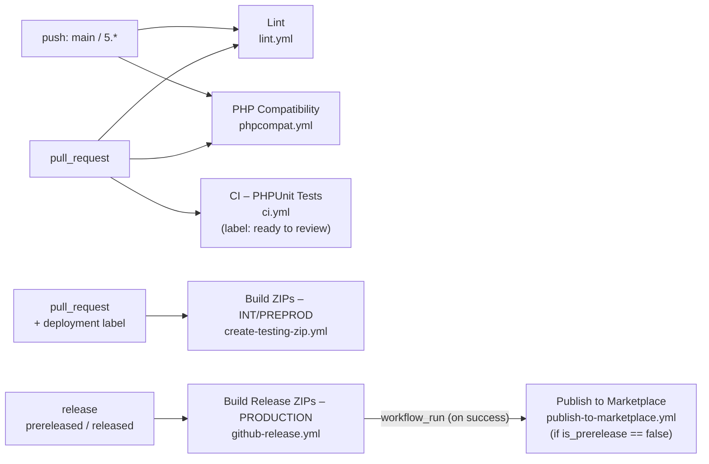

# GitHub CI/CD Reference

All workflows, composite actions, required secrets, and the release pipeline dependency chain.

---

## Dependency map

---

## PR / Push workflows

### `lint.yml` — Lint

**Triggers:** `pull_request`, `push` to `main` or `5.*`

Two parallel jobs — no dependency between them.

| Job | What it does |
|---|---|
| `php-cs-fixer` | Runs `composer cs:ci`, pipes output through `cs2pr` for inline PR annotations. PHP 8.5. |
| `phpstan` (matrix: ps17 / ps8 / ps9) | Runs `composer phpstan:ci` inside each PS-version directory. PHP 8.5, `--ignore-platform-reqs`. |

---

### `phpcompat.yml` — PHP Compatibility

**Triggers:** `pull_request`, `push` to `main` or `5.*`

Checks the codebase stays compatible with PHP 7.1 targets via PHPCompatibility sniffs. Single job, no matrix.

| Step | Detail |
|---|---|
| Setup | PHP 8.5, `composer install` |
| Check | `composer phpcompat:71` |

---

### `ci.yml` — CI – PHPUnit Tests

**Triggers:** `pull_request` (opened, synchronize, reopened, labeled) — **only when the `ready to review` label is present.**

The label gate is intentional: avoids burning runner time on WIP PRs. The workflow runs when the label is added or the PR is synchronized after it was added.

**Matrix:** ps17 · PS 1.7.7.0 · PHP 7.2 / ps8 · PS 8.1.5 · PHP 8.1 / ps9 · PS 9.0.0 · PHP 8.4

**Services:** MariaDB 10.9 (health-checked)

Steps per matrix leg:
1. Pull the matching PrestaShop Docker image and start a container against the MariaDB service
2. Wait for PrestaShop auto-install to complete (polls every 5 s, timeout 5 min)
3. Copy the module and all monorepo packages into the container; run `composer install`
4. Run PHPUnit for **infrastructure**, **utility**, **core**, and **presentation** (unit suites)
5. Install the module via `bin/console prestashop:module install`, create the integration test database
6. Run **core integration** tests
7. Stop the container (always, even on failure)

---

## Release pipeline

### `github-release.yml` — Build Release ZIPs – PRODUCTION

**Triggers:** `release: prereleased`, `release: released`

**Concurrency:** grouped by `workflow + tag_name` — superseded runs are cancelled.

Builds and attaches one ZIP per PS version to the GitHub Release. Handles both the standard pre-release → promote flow and direct latest-release creation. Exits green (skipping the build) when ZIPs already exist, so the downstream `workflow_run` can fire correctly.

**Jobs:**

#### `save-release-context`

Writes the release tag name to a file and uploads it as a `release-tag` artifact (retention: 1 day). This is the reliable source of the tag for the publish workflow — `head_branch` in `workflow_run` context resolves to the branch name (`main`), not the tag.

#### `prepare-zip` (matrix: ps17 · PHP 7.2 / ps8 · PHP 8.1 / ps9 · PHP 8.4)

| Step | Detail |
|---|---|
| Generate release filename | `ps_checkout-v{suffix}.{clean_tag}.zip` — e.g. `ps_checkout-v8.5.5.0.zip` for tag `v5.5.0` |
| Check if ZIP already exists | Queries release assets via `gh release view`; sets `artifact_exists` output |
| Auth GCP | `.github/actions/auth-gcp` with production secrets |
| Write production `.env` | Fetches `module-v5-env` from GCP Secret Manager (production project) |
| Package module | Calls `.github/actions/package-module` — see [Composite actions](#composite-actions) |
| Upload ZIP to GitHub Release | Attaches the ZIP using `artifact_exists != 'true'` guard |

**Secrets required:** `WI_PROVIDER_V2_PRODUCTION`, `WI_SA_V2_PRODUCTION`, `GCP_PROJECT_PRODUCTION`, `GITHUB_TOKEN`

---

### `publish-to-marketplace.yml` — Publish to Marketplace

**Triggers:** `workflow_run` on "Build Release ZIPs – PRODUCTION" — `completed`

Only runs when the triggering workflow concluded with `success`. Uses `prestashop/publish-on-marketplace` to call the marketplace seller API.

**Jobs:**

#### `check-release`

Runs when `workflow_run.conclusion == 'success'`.

1. Downloads the `release-tag` artifact from the triggering run using `run-id`
2. Calls `gh api /repos/.../releases/tags/{tag}` to resolve `is_prerelease`, `clean_tag`, and the release body (changelog)
3. Uploads the changelog as a `release-changelog` artifact so each matrix leg in `publish` can download it without a redundant API call

Outputs: `tag`, `clean_tag`, `is_prerelease`

#### `publish` (matrix: suffix 7 / 8 / 9)

Only runs when `needs.check-release.outputs.is_prerelease == 'false'`.

| Step | Detail |
|---|---|
| Verify release ZIP is available | `gh release view` — fails with a clear `::error::` if the asset is missing |
| Download release ZIP | `gh release download --pattern` |
| Install publishing tool | `composer global require prestashop/publish-on-marketplace` |
| Publish to Marketplace | `publish-on-marketplace --archive --metadata-json --changelog-file --debug` |

Metadata files: `.github/mktp-metadata-{7|8|9}.json` — `compatible_from` is `1.7.7.0` / `8.0.0` / `9.0.0`. Product ID: `46347`.

**Secrets required:** `MARKETPLACE_API_KEY`, `GITHUB_TOKEN`

#### Release flows

| Flow | Trigger chain | Publishes? |
|---|---|:---:|
| Pre-release created | `prereleased` → github-release.yml builds ZIPs → workflow_run fires → `is_prerelease=true` → publish skipped | No |
| Pre-release promoted to latest | `released` → github-release.yml runs, ZIPs exist → exits green → workflow_run fires → `is_prerelease=false` → publishes | Yes |
| Direct latest release | `released` → github-release.yml builds ZIPs → exits green → workflow_run fires → `is_prerelease=false` → publishes | Yes |

---

## Testing deployment

### `create-testing-zip.yml` — Build Module ZIPs – INT/PREPROD

**Triggers:** `pull_request` (edited, labeled, synchronize) — only when a deployment label is present.

| Label | Environment |
|---|---|
| `prestabulle1` … `prestabulle9` | Integration (env-specific GCP secrets) |
| `preproduction deployment` | Preproduction |

**Jobs:**

#### `generate-shared-date`

Produces a shared timestamp (now + 2 h, format `YYYY-MM-DD_HH-MM-SS`) used in all three ZIP bucket paths so matrix legs sort together.

#### `prepare-zip` (matrix: ps17 · PHP 7.2 / ps8 · PHP 8.1 / ps9 · PHP 8.4)

| Step | Detail |
|---|---|
| Determine Environment | Reads PR labels to pick env, resolves GCP secret names |
| Auth GCP | `.github/actions/auth-gcp` with env-specific secrets |
| Write `.env` | Fetches the environment-specific config from GCP Secret Manager |
| Package module | Calls `.github/actions/package-module`; the `.env` above is embedded in the ZIP |
| Generate GCP bucket filename | `pr{n}/ps_checkout-{suffix}-{env}-{n}-{date}.zip` |
| Upload to GCP bucket | `gsutil cp {zip_path} gs://ps-eu-w1-checkout-assets-{env}/{filename}` |

**Secrets required:** `WI_PROVIDER_V2_{INTEGRATION|PREPRODUCTION}`, `WI_SA_V2_{INTEGRATION|PREPRODUCTION}`, `GCP_PROJECT_{INTEGRATION|PREPRODUCTION}`

---

## Composite actions

### `.github/actions/package-module`

Sets up PHP, builds, and packages a `ps_checkout` module version into a production-ready ZIP. The calling workflow must write the correct `.env` to the workspace root before invoking — the action will fail loudly if it is missing.

**Inputs:**

| Input | Required | Description |
|---|:---:|---|
| `module_dir` | ✓ | Module directory: `ps17`, `ps8`, or `ps9` |
| `module_suffix` | ✓ | PS major version suffix: `7`, `8`, or `9` |
| `php_version` | ✓ | PHP version passed to `shivammathur/setup-php` |
| `release_filename` | ✓ | Output ZIP filename, e.g. `ps_checkout-v8.5.5.0.zip` |

**Output:** `zip_path` — absolute path to the generated ZIP. Use `${{ steps.<id>.outputs.zip_path }}` in subsequent steps.

**Steps:**
1. `shivammathur/setup-php@v2` with the given PHP version
2. `composer install --no-dev --prefer-dist --optimize-autoloader` inside `module_dir`
3. Copy `api/`, `core/`, `infrastructure/`, `presentation/`, `utility/` into `module_dir/vendor/invertus/`
4. Strip dev artefacts: `.php-cs-fixer.*`, `tests/`, `vendor/tests/`, `phpstan.neon`, `phpstan-baseline.neon`, all `monorepo.json` files, `vendor/invertus/*/tests/`
5. Assert `.env` exists; copy into the package
6. Zip the package, output `zip_path`

**Used by:** `github-release.yml`, `create-testing-zip.yml`

---

### `.github/actions/auth-gcp`

Authenticates to Google Cloud via Workload Identity Federation (keyless — no long-lived service account keys). Optionally installs the gcloud SDK and configures Docker or GKE authentication.

**Key inputs:**

| Input | Required | Default | Description |
|---|:---:|---|---|
| `provider` | ✓ | — | GCP Workload Identity Provider URL |
| `service-account` | ✓ | — | Service account email to impersonate |
| `setup-gcloud` | | `false` | Install the gcloud SDK |
| `registry-login` | | `false` | Configure Docker for GCP Artifact Registry (`europe-west1-docker.pkg.dev`) |
| `gke-cluster-name` | | `""` | If set, adds kubectl credentials for the named cluster |

**Used by:** `github-release.yml`, `create-testing-zip.yml`

---

## Secrets reference

| Secret | Description | Used by |
|---|---|---|
| `MARKETPLACE_API_KEY` | PrestaShop Marketplace seller API key | `publish-to-marketplace.yml` |
| `WI_PROVIDER_V2_PRODUCTION` | GCP Workload Identity Provider — production | `github-release.yml` |
| `WI_SA_V2_PRODUCTION` | GCP service account email — production | `github-release.yml` |
| `GCP_PROJECT_PRODUCTION` | GCP project ID — production | `github-release.yml` |
| `WI_PROVIDER_V2_PREPRODUCTION` | GCP Workload Identity Provider — preproduction | `create-testing-zip.yml` |
| `WI_SA_V2_PREPRODUCTION` | GCP service account email — preproduction | `create-testing-zip.yml` |
| `GCP_PROJECT_PREPRODUCTION` | GCP project ID — preproduction | `create-testing-zip.yml` |
| `WI_PROVIDER_V2_INTEGRATION` | GCP Workload Identity Provider — integration (prestabulle) | `create-testing-zip.yml` |
| `WI_SA_V2_INTEGRATION` | GCP service account email — integration | `create-testing-zip.yml` |
| `GCP_PROJECT_INTEGRATION` | GCP project ID — integration | `create-testing-zip.yml` |
| `GITHUB_TOKEN` | Auto-provided by GitHub Actions. Release asset upload/download, GH CLI calls. | `github-release.yml`, `publish-to-marketplace.yml` |
