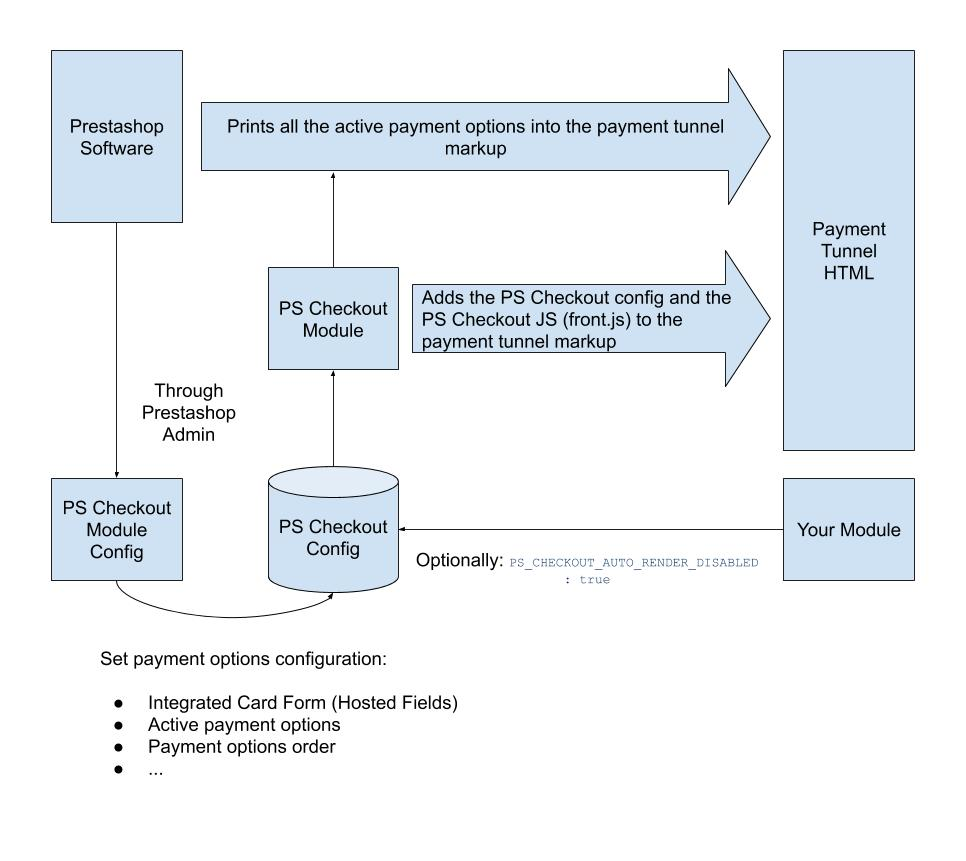
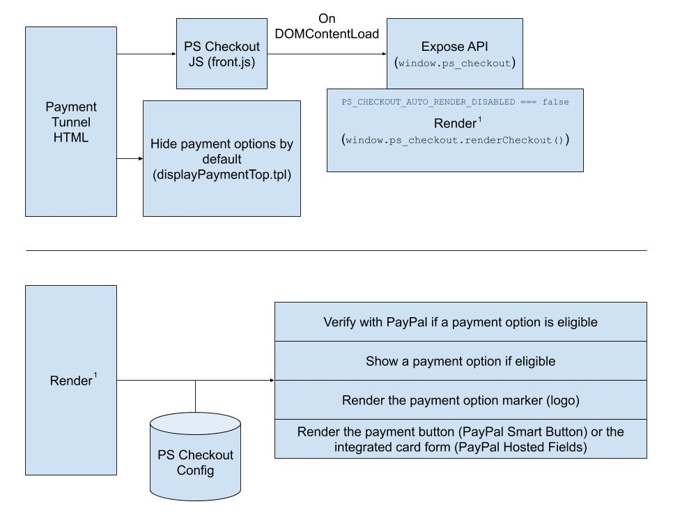

# PrestaShop Checkout Module

**PrestaShop Checkout** is a PayPal payment solution integrated by **PrestaShop** that is being used by thousands of stores 
so far. It was designed to work with the default PrestaShop Theme, but it contains a set of settings that allows 
you to customize it for your own PrestaShop themes and modules.

## In-depth module description
These schemas provide further info on how PrestaShop Checkout generates the HTML on the payment tunnel and how we set the
initialization javascript code.

### HTML Generation


### Front-end Initialization


#### Notes
- Only eligible payment options will unhidden at the end of the render process, even if they are active on the
configuration.
- You can check which payment options will be tested for eligibility by checking the variable
`ps_checkoutFundingSourcesSorted` in your devtools.
- The integrated card form (hosted fields) appears if all these conditions are satisfied:
    - The card payment option is active
    - The 'Integrated Credit Card Fields' option is active in the module configuration (Advanced Options)*
    - The card payment option is eligible (checked by PayPal)
    - The PayPal SDK has been loaded with a client token**

\* You can verify this by checking the variable `ps_checkoutHostedFieldsEnabled` in your devtools.

\** You can verify this by looking the 'Network' tab in your devtools and checking that the endpoint
`/module/ps_checkout/token` has been called without errors.
 
## Customizing Ps Checkout

**PrestaShop Checkout** internally uses a global `window.ps_checkout` javascript object to implement **PayPal Checkout**
specifications. You can use that object wherever you need to render the payment plugin. You can also customize 
the way the payment tunnel is rendered by defining your own html selectors, and you can subscribe to a few events 
to interact with PrestaShop Checkout.

### Query Selector Replacement

**PrestaShop Checkout** uses query selectors to identify each part of the payment plugin in your html. If you want to use your 
own selectors instead, you can define a `window.ps_checkout.selectors` object before loading **PrestaShop Checkout** module, 
so that configuration will be merged with the default one.

```js
// Default query selectors used by PrestaShop Checkout
window.ps_checkout.selectors = {
  // The default payment confirmation button created by PrestaShop. This will be used on the payment tunnel
  // with a express checkout order or as confirmation button for the integrated card form (hosted fields) in PrestaShop 1.7
  BASE_PAYMENT_CONFIRMATION: '#payment-confirmation [type="submit"]',

  // All the TOS-like checkboxes that must be checked before the client can confirm the order.
  CONDITIONS_CHECKBOXES: '#conditions-to-approve input[type="checkbox"]',

  // Container where the 'loading screen' will be appended. The loader screen will appear to lock the
  // site until the payment has been confirmed/cancelled/errored.
  LOADER_PARENT: 'body',

  // Notification promted when the user has not accepted all the checkboxes defined with
  // `CONDITIONS_CHECKBOXES`
  NOTIFICATION_CONDITIONS: '.accept-cgv',

  // Notification promted on payment cancel
  NOTIFICATION_PAYMENT_CANCELLED: '#ps_checkout-canceled',
  // Notification promted on payment error
  NOTIFICATION_PAYMENT_ERROR: '#ps_checkout-error',
  // Container for the error extra information
  NOTIFICATION_PAYMENT_ERROR_TEXT: '#ps_checkout-error-text',

  // Container for all the payment options
  PAYMENT_OPTIONS: '.payment-options',

  // Only for PrestaShop 1.7
  // Radio buttons of each payment option. This will be used to add a listener that hides the notifications
  // on payment option selection change.
  PAYMENT_OPTION_RADIOS:
    '.payment-options input[type="radio"][name="payment-option"]',
  
  // Container where the ExpressCheckout button will be appended.
  EXPRESS_CHECKOUT_CONTAINER_PRODUCT_PAGE:
    '#product .product-add-to-cart .product-quantity',
  EXPRESS_CHECKOUT_CONTAINER_CART_PAGE:
    '#cart .cart-summary .cart-detailed-actions',
  EXPRESS_CHECKOUT_CONTAINER_CHECKOUT_PAGE:
    '#checkout-personal-information-step .content',
}
```

#### Use Cases
##### I want to use my own notifications
```js
// In a .js file loaded before PrestaShop Checkout main file (front.js)
window.ps_checkout = {
  selectors: {
    NOTIFICATION_CONDITIONS: '.my-class-for-notifications.tos-not-accepted',
  
    NOTIFICATION_PAYMENT_CANCELLED: '.my-class-for-notifications.on-payment-cancelled',
    NOTIFICATION_PAYMENT_ERROR: '.my-class-for-notifications.on-payment-error',
    NOTIFICATION_PAYMENT_ERROR_TEXT: '.my-class-for-notifications.on-payment-error .text-body',
  }
}
```

### Event Subscription
**PrestaShop Checkout** emits some events to which you can subscribe, you just need to create a new EventTarget inside 
window.ps_checkout.events:  

```js
window.ps_checkout.events = new EventTarget();
// PrestaShop Checkout has been initialized but not rendered.
window.ps_checkout.events.addEventListener('init', ({detail}) => {
    // === window.ps_checkout
    const {ps_checkout} = detail;
    // ...
});

// Payment Option is active
window.ps_checkout.events.addEventListener('payment-option-active', ({detail}) => {
    const {
        // HTMLNode of the Payment Option
        HTMLElementContainer,
        // Funding Source constant name
        fundingSource
    } = detail;
    // ...
});

// PrestaShop Checkout has just been rendered.
window.ps_checkout.events.addEventListener('loaded', ({detail}) => {
    // === window.ps_checkout
    const {ps_checkout} = detail;
    // ...
});

// Hosted Fields : a field gains focus.
window.ps_checkout.events.addEventListener('hostedFieldsFocus', ({detail}) => {
  console.log('HostedFields : field ' + detail.event.emittedBy, 'gained focus');
});

// Hosted Fields : a field lost focus.
window.ps_checkout.events.addEventListener('hostedFieldsBlur', ({detail}) => {
  console.log('HostedFields : field ' + detail.event.emittedBy, 'lost focus');
});

// Hosted Fields : a field is now empty.
window.ps_checkout.events.addEventListener('hostedFieldsEmpty', ({detail}) => {
  console.log('HostedFields : field ' + detail.event.emittedBy, 'is now empty');
});

// Hosted Fields : a field has data.
window.ps_checkout.events.addEventListener('hostedFieldsNotEmpty', ({detail}) => {
  console.log('HostedFields : field ' + detail.event.emittedBy, 'has data');
});

// Hosted Fields : card type change.
window.ps_checkout.events.addEventListener('hostedFieldsCardTypeChange', ({detail}) => {
  if (detail.event.cards.length === 1) {
    console.log('HostedFields : type of card is now ' + detail.event.cards[0].type);
  } else {
    console.log('HostedFields : type of card not yet known');
  }
});

// Hosted Fields : a field validity change.
window.ps_checkout.events.addEventListener('hostedFieldsValidityChange', ({detail}) => {
  const field = detail.event.fields[detail.event.emittedBy];

  if (field.isValid) {
    console.log('HostedFields : field ' + detail.event.emittedBy, 'is fully valid');
  } else if (field.isPotentiallyValid) {
    console.log('HostedFields : field ' + detail.event.emittedBy, 'is potentially valid');
  } else {
    console.log('HostedFields : field ' + detail.event.emittedBy, 'is not valid');
  }
});

// Hosted Fields : customer requested submission, e.g. by pressing Enter or equivalent
window.ps_checkout.events.addEventListener('hostedFieldsInputSubmitRequest', ({detail}) => {
  console.log('HostedFields : customer requested submission, e.g. by pressing Enter or equivalent');
});
```

#### Use Cases
##### (1.7) I want to wrap a container around my payment options but PrestaShop Checkout just hide the inner container
```js
// In a .js file loaded before PrestaShop Checkout main file (front.js)
window.ps_checkout = {
  events: new EventTarget(),
}

window.ps_checkout.events.addEventListener('init', () => {
    const paymentOptions = Array.prototype.slice.call(
        document.querySelectorAll('[data-module-name^="ps_checkout"]')
    );

    const paymentOptionContainers = paymentOptions
        .map(paymentOption => paymentOption
            // Default payment option container
            .parentElement.parentElement
            // Container added by my module / theme
            .parentElement);

    // Hide all wrappers
    paymentOptionContainers.forEach(myContainer => myContainer.style.display = 'none');
});

window.ps_checkout.events.addEventListener('payment-option-active', ({detail}) => {
    const { HTMLElementContainer } = detail;
    const myHTMLElementContainer = HTMLElementContainer.parentElement;

    myHTMLElementContainer.style.display = '';
});
```

### Styling ExpressCheckout PayPal Button
If you want to use your
own style, you can define a `window.ps_checkout.PayPalExpressCheckoutButtonCustomization` object before loading **PrestaShop Checkout** module,
so that configuration will be merged with the default one.

```js
// In a .js file loaded before PrestaShop Checkout main file (front.js)
window.ps_checkout.PayPalExpressCheckoutButtonCustomization = {
  layout: 'vertical',
  color: 'blue',
  shape: 'pill',
  label: 'checkout'
};
```

### Styling PayPal Button
If you want to use your
own style, you can define a `window.ps_checkout.hostedFieldsCustomization` object before loading **PrestaShop Checkout** module,
so that configuration will be merged with the default one.

```js
// In a .js file loaded before PrestaShop Checkout main file (front.js)
window.ps_checkout.PayPalButtonCustomization = {
  layout: 'vertical',
  color: 'blue',
  shape: 'pill',
  label: 'buynow'
};
```

#### Supported properties:

* `layout` : `vertical` (Default) or `horizontal`
* `color` : `gold` (Recommended) or `blue`, `silver`, `white`, `black`
* `shape` : `rect` (Recommended) or `pill`
* `label` : `paypal` (Recommended) or `checkout`, `buynow`, `pay`
* `tagline` : `true` (Recommended ; not allowed for `vertical` layout) or `false`

### Styling HostedFields
If you want to use your
own style, you can define a `window.ps_checkout.hostedFieldsCustomization` object before loading **PrestaShop Checkout** module,
so that configuration will be merged with the default one.

```js
// In a .js file loaded before PrestaShop Checkout main file (front.js)
window.ps_checkout.hostedFieldsCustomization = {
  'input': {
    'color': '#3A3A3A'
  },
  ':focus': {
    'color': '#2fb5d2'
  },
  '.invalid': {
    'color': '#e76d7a'
  },
  '.valid': {
    'color': '#6fcc80'
  },
  '.number': {
    'font-family': 'helvetica, tahoma, calibri, sans-serif'
  },
  '.cvv': {
    'font-family': 'Georgia, serif'
  },
  '.expirationDate': {
    'font-family': 'Verdana, Arial, Helvetica, sans-serif'
  },
};
```

#### Supported CSS properties:

* `appearance`
* `color`
* `direction`
* `font-family`
* `font-size-adjustfont-size`
* `font-stretch`
* `font-style font-variant-alternates`
* `font-variant-capsfont-variant-east-asian`
* `font-variant-ligatures font-variant-numeric`
* `font-variantfont-weight`
* `font`
* `letter-spacing`
* `line-height`
* `opacity`
* `outline`
* `padding`
* `text-shadowtransition`
* `-moz-appearance`
* `-moz-osx-font-smoothing`
* `-moz-tap-highlight-color`
* `-moz-transition`
* `-webkit-appearance`
* `-webkit-font-smoothing`
* `-webkit-tap-highlight-color`
* `-webkit-transition`

### Manual Rendering of Payment Tunnel
By default, **PrestaShop Checkout** will render the payment tunnel, and the default express checkout buttons 
(if you have activated Express Checkout), wherever needed in the default theme.

You can disable this behaviour by setting the following php configuration on your module:
```php
Configuration::updateValue('PS_CHECKOUT_AUTO_RENDER_DISABLED', true);
```

Now, you can manually render:

* The payment tunnel:
```js
// Once PrestaShop Checkout has been loaded
window.ps_checkout.renderCheckout();
```

* The default ExpressCheckout buttons:
```js
// Once PrestaShop Checkout has been loaded
window.ps_checkout.renderExpressCheckout();
``` 

* Your own Express Checkout buttons:
```js
// Once PrestaShop Checkout has been loaded
window.ps_checkout.renderExpressCheckout({
    HTMLElement: document.querySelector(".my-selector")
});

// To associate the button to a custom product instead of the default cart 
window.ps_checkout.renderExpressCheckout({
    HTMLElement: document.querySelector(".my-selector"),
    productData: {
        id_product: 'PrestaShop Product ID',
        id_product_attribute: 'PrestaShop Product Attribute',
        id_customization: 'PrestaShop Product Customization',
        quantity_wanted: 'PrestaShop Product Quantity',
    }
});
```

#### Use Cases
##### I want PrestaShop Checkout to wait for my module to do something before rendering the payment tunnel
```js
// With the default rendering disabled
// In a .js file loaded before PrestaShop Checkout main file (front.js)
window.ps_checkout = {
  events: new EventTarget(),
}

window.ps_checkout.events.addEventListener('loaded', () => {
    // ... Your initialization code
    window.ps_checkout.renderCheckout();
});
```
> The `payment-option-active` event won't be triggered until `window.ps_checkout.renderCheckout();` has been executed. 


##### I want PrestaShop Checkout to wait for my module to do something before rendering the default express checkout buttons
```js
// With the default rendering disabled
// In a .js file loaded before PrestaShop Checkout main file (front.js)
window.ps_checkout = {
  events: new EventTarget(),
}

window.ps_checkout.events.addEventListener('loaded', () => {
    // ... Your initialization code
    window.ps_checkout.renderExpressCheckout();
});
```

##### I want to render my own Express Checkout buttons
```js
// With the default rendering disabled
// In a .js file loaded before PrestaShop Checkout main file (front.js)
window.ps_checkout = {
  events: new EventTarget(),
}

window.ps_checkout.events.addEventListener('loaded', () => {
    window.ps_checkout.renderExpressCheckout({
        HTMLElement: document.querySelector(".my-express-checkout-button.first-button")
    });

    window.ps_checkout.renderExpressCheckout({
        HTMLElement: document.querySelector(".my-express-checkout-button.second-button")
    });

    window.ps_checkout.renderExpressCheckout({
        HTMLElement: document.querySelector(".my-express-checkout-button.third-button")
    });
});
```

## WIP
> Even if `window.ps_checkout.renderExpressCheckout` is available in PrestaShop 1.6, Express Checkout
> buttons will only be rendered for PrestaShop 1.7 for the moment. This will be available in PrestaShop 1.6 soon.

## TODO
- Should we also allow the contributors to subscribe to SDK events (onCancel, onCapture...) ?
